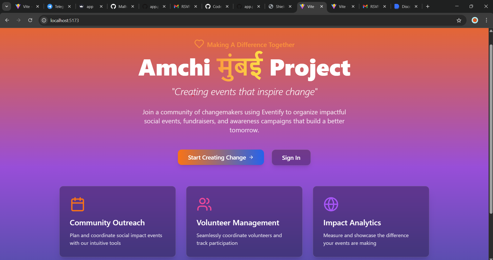
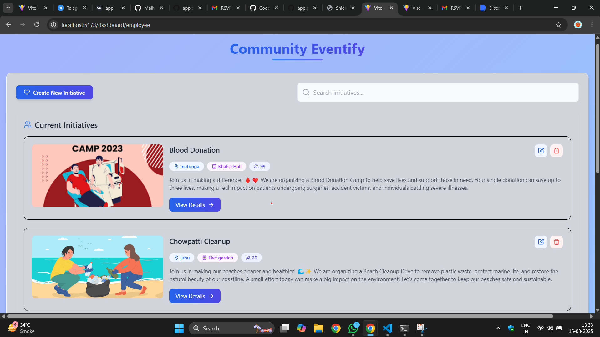
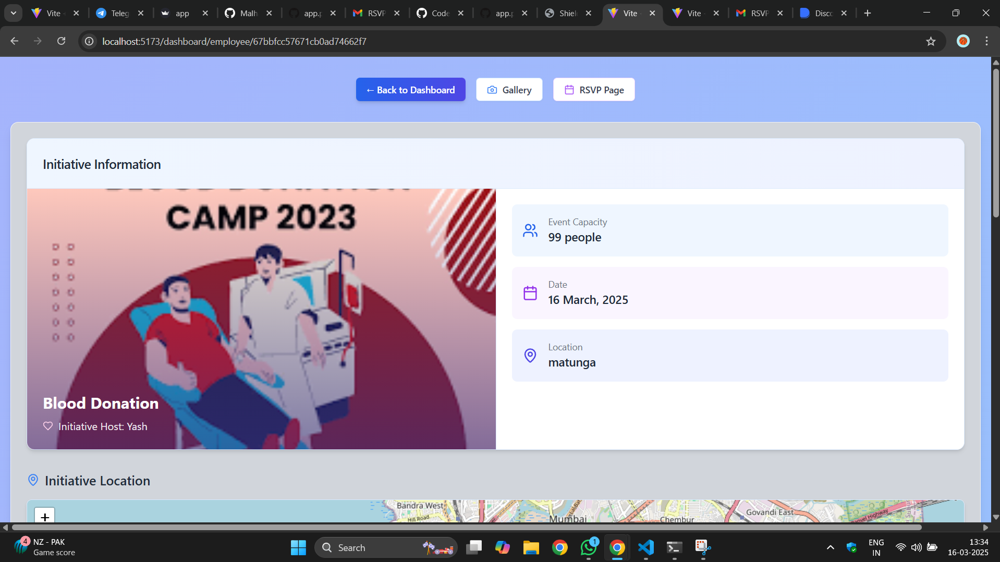
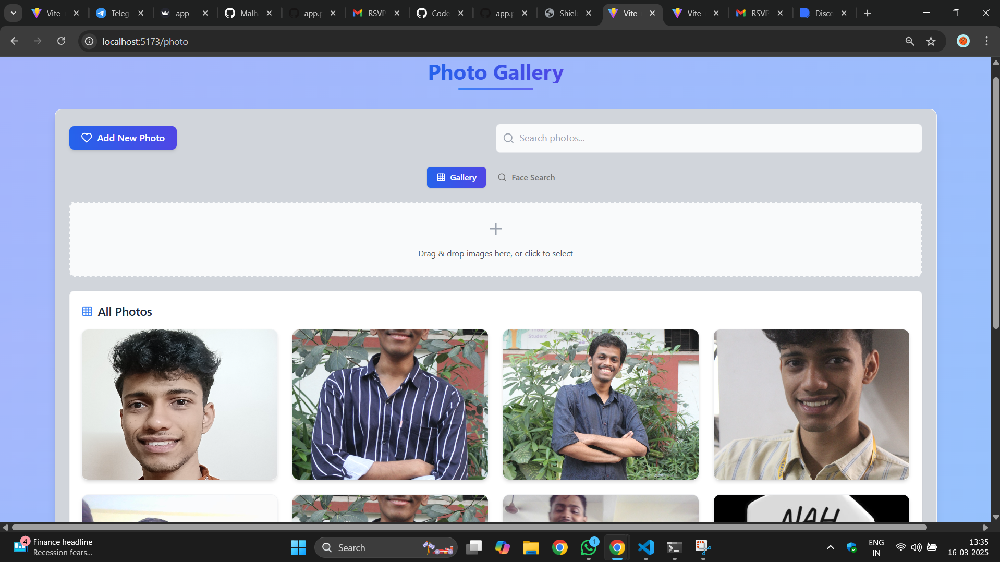
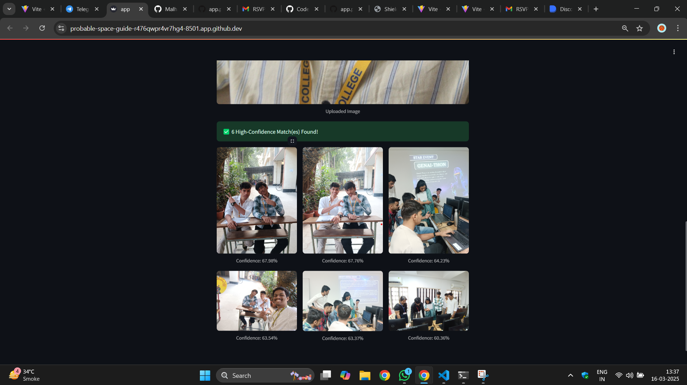
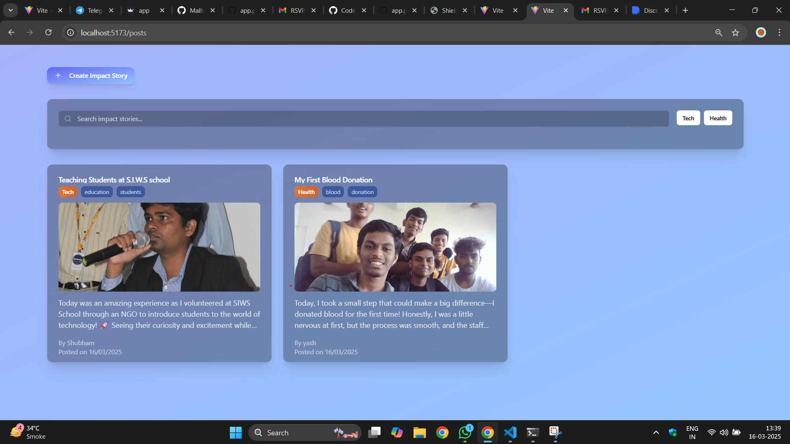

# 🤝 **Aamchi मुंबई – Smart NGO Event Management System**  

🚀 **A platform that connects volunteers with NGO events, ensuring impactful participation based on skills, interests, and location.** 🚀  

Aamchi मुंबई enables NGOs to efficiently manage events while allowing volunteers to track their contributions, measure their impact, and showcase their achievements through a personalized dashboard.  

---  

## 🌟 **Features**  

- **🔍 Smart Volunteer Matching** – Connects volunteers to relevant NGO events based on skills, interests, and proximity.  
- **📅 Event Management & RSVP** – NGOs can create, update, and manage volunteer participation seamlessly.  
- **📊 Impact Dashboard** – Volunteers can track their event participation, view their social impact, and share achievements.  
- **🤖 Telegram Bot Integration** – Browse, RSVP, and receive event updates directly through Telegram.  
- **🖼️ Face-Based Photo Search** – Find event images effortlessly using face recognition.  
- **📷 Media Gallery & Event Memories** – Volunteers can upload and view images from past events.  

---  

## 🛠️ **Tech Stack**  

- **Frontend:** React, Tailwind CSS, ShadCN  
- **Backend:** Node.js, Express.js  
- **Database:** MongoDB  
- **AI & Image Processing:** TensorFlow.js, Face API  
- **Messaging & Notifications:** Telegram Bot API, EmailJS  

---  

## 📋 **Key Functionalities**  

1. **Volunteer Matching System** – AI-powered recommendations based on user profiles.  
2. **Real-Time Event Updates** – Telegram bot integration for instant notifications.  
3. **Face-Based Image Search** – Locate event photos using facial recognition.  
4. **Personalized Impact Dashboard** – Displays total participation, impact metrics, and achievements.  
5. **RSVP & Event Check-In System** – Streamlined process for managing volunteer participation.  
6. **Event Media Hub** – A shared gallery for volunteers to upload and relive memories.  

---  

## 🚧 **Challenges Faced**  

- **🔗 Integrating Telegram Bot** – Ensuring smooth event browsing, RSVP, and notifications via Telegram.  
- **🖼️ Face-Based Photo Search** – Implementing accurate and efficient face detection to retrieve volunteer images.  
- **📊 Impact Metrics Calculation** – Defining meaningful parameters to measure volunteer contributions effectively.  

---
---

## 📸 Screenshots  

### 1️⃣ Landing Page  
  

### 2️⃣ Dashboard 
  

### 3️⃣ Event Details
  

### 4️⃣ Guest RSVP Page  
  

### 5️⃣ Image Gallery
  

### 6️⃣ Face Recognition in Album
  

### 7️⃣ Telegram Bot
  

### 8️⃣ Community
 

---

## 📜 **Credits**  
- **Developers**: [@Shubham_Bendre](https://github.com/Shubham-Bendre), [@Malhar_Singh](https://github.com/Malhar2400), [@Yash_Chougule](https://github.com/YxASH)

---
Let me know if you need any more tweaks! 🚀🔥
